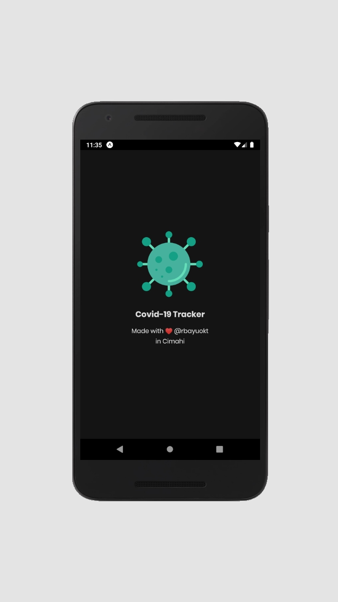
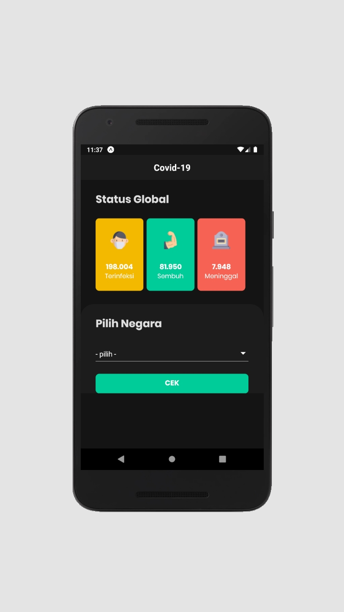
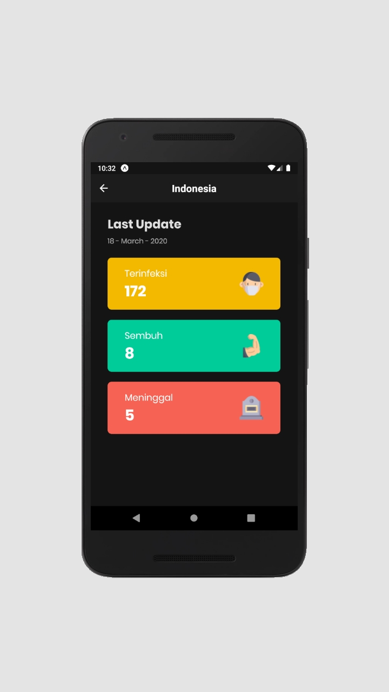

# Covid19 Tracker
Adalah aplikasi untuk memonitoring data penyebaran virus covid-19 di seluruh dunia,
dibuat menggunakan react native dan API yang dibuat oleh mas [@mathroid](https://github.com/mathdroid/covid-19-api) :thumbsup:
makasih mas untuk API nya.

# Tools
- [x] React Native
- [x] Visual Code
- [x] Android Emulator

# Fitur
- [x] Pull To Refresh
- [x] Load then show ( atau loading dulu baru nampil data wkwk )
- [x] Fitur lainnya menyusul...

# Library yang digunakan
- [x] React Native Dropdown [link](https://www.npmjs.com/package/react-native-material-dropdown)
- [x] WHC Loading [link](https://github.com/netyouli/react-native-whc-loading)
- [x] Pull To Refresh
- [x] Axios

# Screenshoot 

**Splash Screen :**  
 

**Home Screen :**  
 

**Updated to v 1.2**
 

**Home Screen :**  
 

**Result Screen :**  
 

**Error Screen :**  
 

 
kalau mau dibuild ulang jangan lupa cantumkan sumbernya 
karena mencantumkan sumber bisa membuat orang lain merasa bahagia :thumbsup: 
goodluck have fun!  

made with :heart: in Cimahi by [@rbayuokt](https://www.instagram.com/rbayuokt/) :thumbsup: 
