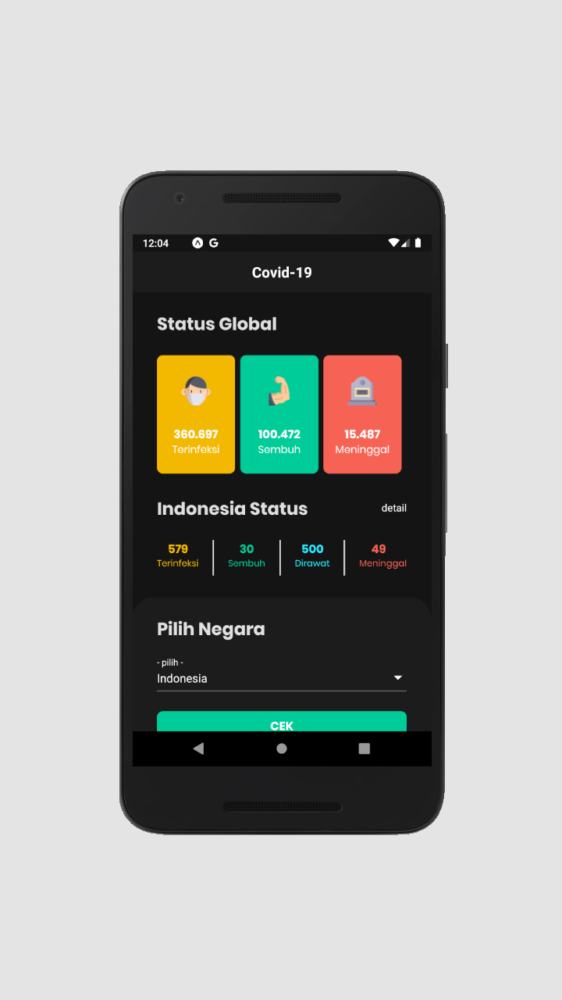

# Covid19 Tracker
Adalah aplikasi untuk memonitoring data penyebaran virus covid-19 di seluruh dunia,
dibuat menggunakan react native dan API yang dibuat oleh mas [@mathroid](https://github.com/mathdroid/covid-19-api) :thumbsup:
makasih mas untuk API nya.

# Update info 
:arrow_forward: [In my twitter](https://twitter.com/rbayuokt/status/1239904791762882561)  
:white_check_mark: [Download here](https://linktr.ee/rbayuokt)  

# Tools
- [x] React Native
- [x] Visual Code
- [x] Android Emulator

# Fitur
- [x] Pull To Refresh
- [x] Load then show ( atau loading dulu baru nampil data wkwk )
- [x] Fitur lainnya menyusul...

# Library yang digunakan
- [x] React Native Dropdown [link](https://www.npmjs.com/package/react-native-material-dropdown)
- [x] WHC Loading [link](https://github.com/netyouli/react-native-whc-loading)
- [x] Pull To Refresh
- [x] Axios

# Screenshoot 

**Splash Screen :**  
 

**Home Screen Updated to v 1.2**  
 

**Result Screen :**  
 

**Indonesia Status Screen :**  
 

**Provinsi Detail Screen :**  
 

**Harian Detail Screen :**  
 

**Kasus Detail Screen :**  
 

**Error Screen :**  
 

 
if you want to rebuild this project 
give the credit , cause it will make me happy :heart: 
goodluck have fun!  

made with :heart: in Cimahi by [@rbayuokt](https://www.instagram.com/rbayuokt/) :thumbsup: 
